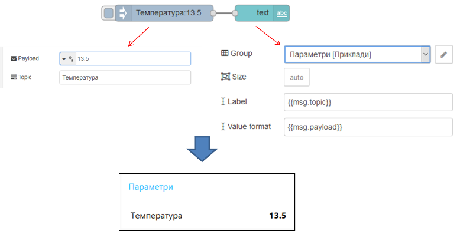

| [На головну](../) | [Розділ](README.md)                                      |
| ----------------- | -------------------------------------------------------- |
|                   | [Основи AngularJS в Node-RED dashboard ->](AngularJS.md) |

## Налаштування віджетів (Widgets)

Кожен віджет крім налаштувань розміщення в групі, які описані вище, має ряд властивостей, що означують його поведінку. Більшість віджетів можуть мати мітку (label) та значення (value) - обидва, якщо це потрібно, можуть бути означені як статичним текстом, так і властивістю вхідного повідомлення (msg), і модифіковані ангулярними виразами (детально про використання ангулярних виразів читай в наступному пункті).  

Наприклад, мітку можна встановити властивістю повідомлення `topic` а значення в `payload` , це робиться через означення їх у подвійних фігурних дужках, тобто `{{msg.topic}}` та `{{msg.payload}}`, як це показано на рисунку.

рис.3.9. Налаштування властивостей віджета через властивості вхідного повідомлення.

Будь-який віджет може бути деактивований шляхом передачі властивості `msg.enabled = false`. Це не зупиняє отримання віджетом повідомлень але зупиняє активність вводу і змінює стиль віджета.

Деякі віджети, що мають графічне зображення (наприклад кнопка) мають налаштування піктограми (**Icon**), яку можна означити через назву. У версії Dashboard 2.11 піктограми доступні з сайтів [Material Design icon](https://design.google.com/icons/) (наприклад *'check', 'close'*)  або [Font Awesome icon](https://fontawesome.com/v4.7.0/icons/)  (наприклад *'fa-fire'*) або [Weather icon](https://github.com/Paul-Reed/weather-icons-lite/blob/master/css/weather-icons-lite.css). Наприклад, якщо зайти на сайт [Material Design icon](https://design.google.com/icons/) можна знайти піктограму з назвою «trending_up». Якщо цю назву вписати у властивість кнопки Icon, біля тексту з’явиться вибране зображення (див. рис.3.10). 

​      

 рис.3.10. Приклад використання піктограм в зображенні кнопки. 

[Основи AngularJS в Node-RED dashboard ->](AngularJS.md)