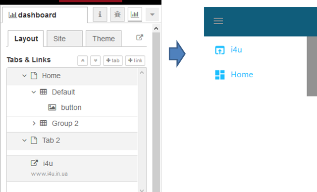
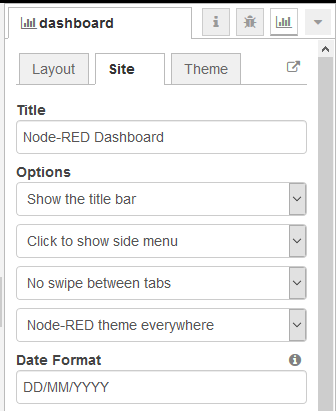
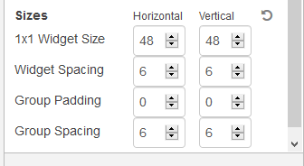
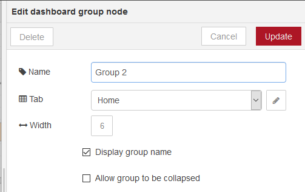
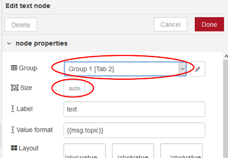

## 3.2. Компонування та налаштування

 

Типова URL-адреса для інформаційної панелі базується на наявному Node-RED httpRoot-шляху, додавши `/ui`. Це можна змінити у файлі settings.js Node-RED - `ui:{path:"ui"}`. Основні властивості, що відносяться до Dashboard налаштовуються через відповідний пункт меню бічної панелі. 

Компонування приладової панелі розглядається у вигляді сітки, до якої прив’язуються елементи (віджети). Сітка вимірюється в одиницях сітки (**unit**), які за замовченням рівні 48px шириною з 6px зазором. За необхідності параметри одиниці та зазори можна змінити в налаштуваннях dashboard -> Site (рис.3.2)

рис.3.2. Налаштування одиниці сітки. 

Приладовий інтерфейс ділиться на вкладки (окремі сторінки), які створюються і налаштовуються на вкладці бічної панелі Layout (компонування).  В налаштуваннях можна змінити порядок вкладок, груп і віджетів, і добавити та редагувати інші властивості. Також тут можна добавити в меню **посилання** (**Links**) на інші веб-сторінки. Це може опціонально бути відкритим в iframe - якщо дозволено цільовою сторінкою (рис.3.3).

 

рис.3.3. Вкладки.

В налаштуваннях Site доступні для зміни також інші властивості, зокрема заголовок (Title), опції (Options) та формат дати (Date Format) (рис.3.4).

. 

рис.3.4. Властивості сайту.

Опції дозволяють сховати рядок заголовка, дозволити переміщуватися збоку між вкладками на сенсорному екрані. Можна також встановити та налаштувати тему, що використовується для відображення.

Елементи (**віджети**) об’єднуються в **групи** (**group**), для яких вказується ширина в одинцях сітки. За замовченням це 6 одиниць (рис.3.5-3.6). 

рис.3.5. Налаштування розміщення груп одна відносно одної в налаштуваннях dashboard -> Site.

рис.3.6. Налаштування розміру групи

Кожен елемент на панелі, що представлений вузлом, - **віджет** (**widget**), розміщується в конкретній групі, яка вибирається в його налаштуваннях (рис.3.7). Для віджета налаштовується ширина, яка за замовченням вказана як «авто» - це значить що елемент буде заповнюватися по ширині групи, в якій знаходиться. Значення ширини можна також встановити її фіксованою в кількостях одиниць.

рис.3.7. Налаштування розміщення віджета в групі

 Алгоритм компонування приладової панелі завжди намагається помістити елементи в верхньому лівому кутку контейнеру - це відноситься як до розміщення груп на сторінці, так саме і до розміщення віджетів в групі. Тобто, з урахуванням групи шириною 6, якщо Ви добавляєте шість віджетів, кожен з шириною 2, тоді вони будуть викладені в два рядки – по три віджета в кожному.  Якщо Ви добавляєте дві групи з шириною 6, вони будуть розміщуватися один біля одного до тих пір, поки дозволяє ширина вікна браузера. Якщо Ви зменшуєте ширину вікна браузера, в деякий момент друга група буде зміщена нижче першої в одну колонку.  Це дозволяє використовувати декілька груп якщо це можливо, а не одну велику групу, так щоб сторінки могли динамічного змінювати розмір для малих екранів. 

На вкладці Theme (рис.3.8) можна означити стилі сторінок.

рис.3.8. Налаштування стилю