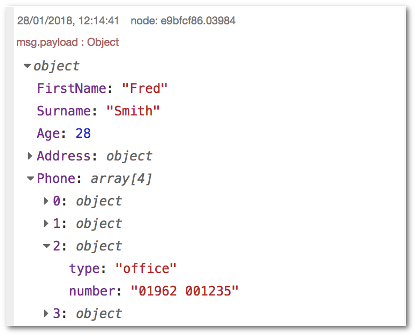
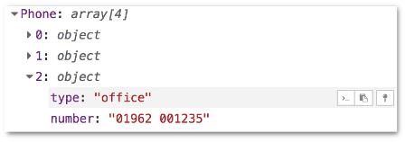
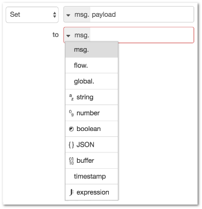

| [На головну](../)                     | [Розділ](README.md)              |
| ------------------------------------- | -------------------------------- |
| [<- Робота з вузлом Function](1_5.md) | [Робота з контекстом ->](1_7.md) |

## Робота з повідомленнями 

Потік Node-RED працює, передаючи повідомлення між вузлами. Повідомлення є простими об\'єктами JavaScript, які можуть мати будь-який набір властивостей. Повідомлення, як правило, мають властивість payload, це властивість за умовчанням, з яким працюватиме більшість вузлів Node-RED також додає властивість, що називається \_msgid - це ідентифікатор для повідомлення, яке може використовуватися для відстеження його проходження потоком

```js
{
"_msgid": "12345",
    "payload": "..."
}
```

Значенням властивості може бути будь-який дійсний тип JavaScript, наприклад

-   Boolean - true, false

-   Number -- наприклад 0, 123.4

-   String - \"hello\"

-   Array - \[1,2,3,4\]

-   Object - { \"a\": 1, \"b\": 2}

-   Null

[Докладніше про типи JavaScript](https://developer.mozilla.org/en-US/docs/Web/JavaScript/Data_structures)

### Розуміння структури повідомлень

Найпростіший спосіб зрозуміти структуру повідомлення - передати його в вузол Debug і переглянути його на бічній панелі Debug. За замовчуванням на вузлі Debug відображатиметься властивість msg.payload , але може бути налаштована для відображення будь-яка інша властивість або все повідомлення цілком. При відображенні масиву або об\'єкту бічна панель забезпечує структурований вигляд, який може використовуватися для вивчення повідомлення.

> {width="3.8854166666666665in" height="3.1354166666666665in"}

рис.1.42. Перегляд структури повідомлення на бічній панелі Debug

-   в самому верху він показує ім\'я властивості, яке було передано. Тут за замовчуванням використано msg.payload 

-   поруч із назвою є назва типу властивості - Object, String, Array ін..

-   потім він показує вміст властивості. Для масивів і об\'єктів властивість розкладається на рядки. Клацаючи по ньому, властивість розгорнеться, щоб показати більш детальну інформацію.

Коли ви наводите курсор миші на будь-який елемент, праворуч з\'являється набір кнопок:

-    :  копіює шлях до обраного елемента у буфер обміну. У цьому прикладі він буде копіювати payload.Phone\[2\].type. Це дозволяє швидко визначити, як отримати доступ до властивості на вузлі Change або Function.

-    :  копіює значення елемента у буфер обміну як рядок JSON. Зауважте, що бічна панель обробляє масиви та буфери певної довжини. Копіюючи значення такої властивості, буде скопійована урізана версія.

-    :  вибирає елемент таким чином, що він завжди відображається. Коли одне повідомлення одержується з того ж вузла відлагодження, його автоматично розширюють, щоб показати всі закріплені елементи.

> 

рис.1.43. Перегляд структури масивів та об'єктів в повідомленні

**JSON** ([JavaScript Object Notation](http://json.org/)) - це стандартний спосіб подання об\'єкта JavaScript у вигляді рядку. Він часто використовується у веб-API для повернення даних. Якщо властивість повідомлення містить рядок JSON, то перед тим, як отримувати доступ до його властивостей, його слід перетворити до еквівалентного об\'єкта JavaScript. Щоб визначити, чи властивість вміщує String чи Object, може бути використаний вузол Debug. Для здійснення цього перетворення Node-RED забезпечує вузол JSON .

### Зміна властивостей повідомлення 

Загальне завдання усіх вузлів в потоці - змінювати властивості повідомлення, яке проходить між вузлами. Наприклад, результатом роботи вузлу  HTTP Request  може бути об\'єкт з багатьма властивостями, з яких потрібні лише деякі.

Для модифікації повідомлення використовують два основні вузли -- [**Function**](#_Function) та [**Change**](#_Change).

Вузол Function дозволяє запускати будь-який код JavaScript для обробки повідомлення. Це дає вам повну гнучкість в тому, що ви робите з повідомленням, але вимагає розуміння JavaScript і не є необхідним для багатьох простих випадків. Більше інформації про написання функцій доступно [за цим посиланням](#_Написання_функцій_(Writing).

Вузол Change забезпечує багато функціональних можливостей без необхідності писати код JavaScript. Він не тільки може змінювати властивості повідомлення, але також може отримати доступ до контексту потоку або глобального контексту.

Він забезпечує чотири основні операції:

-   Set - встановлення значення властивості,

-   Change - пошук та заміна частини властивості типу String

-   Delete -- видалення властивості

-   Move -- переміщення властивості.

Для операції set ви спочатку означуєте, яку властивість хочете встановити, тоді значення, яке ви хочете мати. Це значення може бути або жорстко закріплене, наприклад, рядок чи число, або це може бути взяте з іншого повідомлення або властивості контексту потоку або глобального контексту. Він також підтримує використання  [JSONata](http://jsonata.org/) для розрахунку нового значення.



рис.1.44. Встановлення властивості потоку з використанням вузу Change

Наприклад, за допомогою можливості вузлів Debug визначати структкру повідомлень, ви можете вставити адресу необхідного атрибуту прямо в поле 'to', з вибраного списку msg. Тоді буде встановлено  msg.payload в значення msg.payload.Phone\[2\].type.

Інший приклад виразу  [JSONata](http://jsonata.org/) полягає в перетворенні температури, що зберігається в  msg.payload.temperature з одиниць Фаренгейта до Цельсія та збереження результату у новій властивості повідомлення  msg.payload.temperature\_c.


рис.1.45. Використання в вузі Change виразів JSONata

```js
{
    "payload": {
        "temperature": 90,
        "temperature_c": 32.22222
    }
}
```

Зауважте, що вирази *JSONata виглядають так само, як JavaScript, але мають деякі ключові відмінності.* *Див [jsonata.org](http://jsonata.org/) *сайт для додаткової інформації*.*

### Послідовності повідомлень

**Послідовність повідомлень** - це впорядкована ​​серія повідомлень, які певним чином пов\'язані між собою. Деякі вузли призначені для обробки таких послідовностей.

Вузол Split може перетворювати одне повідомлення, яке є масивом payload , у послідовність повідомлень, де кожне повідомлення містить payload що відповідає одному з елементів масиву.

Кожне повідомлення в послідовності має властивість  msg.parts. Це об\'єкт, який містить інформацію про те, як повідомлення входить у послідовність. Він має такі властивості:

`msg.parts.id` - унікальний ідентифікатор в  послідовності 

`msg.parts.index - `позиція повідомлення в межах послідовності 

`msg.parts.count` - якщо відомо, загальна кількість повідомлень у послідовності 

*Примітка:* масив parts може містити додаткові метадані про послідовність. Наприклад,  вузол split  також надає інформацію, яка може бути використана  вузлом join  для повторного зібрання послідовності. Див  документацію для вузла split .

Є кілька основних вузлів, які можуть працювати з послідовностями повідомлень.

#### Split

Перетворює одне повідомлення в послідовність повідомлень. Конкретна поведінка вузла залежить від типу msg.payload:

-   String/Buffer - повідомлення розділяється за допомогою заданого символу (за замовчуванням: \`\\ n\`) на буферні послідовності (байт-масиви) або рядки фіксованої довжини.

-   Array - повідомлення розділяється на окремі елементи масиву чи масиви фіксованої довжини

-   Object - повідомлення надсилається для кожної пари об\'єкта ключ/значення.

#### Join

{width="1.4270833333333333in" height="0.3645833333333333in"}Перетворює послідовність повідомлень у єдине повідомлення. Вузол забезпечує три режими роботи:

-   Automatic - спроба зробити зворотну дію, проведену попереднім вузлом Split

-   Manual - дозволяє точніше керувати, як слід об'єднати послідовність

-   Reduce - дозволяє виконувати вираз JSONata для кожного повідомлення в послідовності, а накопичений результат використати для створення одного повідомлення.

#### Sort

Сортує послідовність повідомлень на основі значення властивості або результату вираження JSONata.

#### Batch

{width="1.4791666666666667in" height="0.4270833333333333in"}Створює нові послідовності повідомлень з отриманих. Вузол забезпечує три режими роботи:

-   Number of messages - групування повідомлень в послідовності заданої довжини. Параметр overlap (перекривання) вказує, скільки повідомлень в кінці однієї послідовності слід повторити на початку наступної послідовності.

-   Time interval - групові повідомлення, що надходять у вказаний інтервал. Якщо протягом вказаного інтервалу не надходить повідомлення, вузол може додатково надіслати порожнє повідомлення.

-   Concatenate Sequences - створює послідовність повідомлень шляхом об\'єднання вхідних послідовностей. Кожна послідовність повинна мати властивість msg.topic  для визначення групи. Вузол налаштовується на список значень тем для ідентифікації порядку конкатенації послідовностей.

[Робота з контекстом ->](1_7.md) 