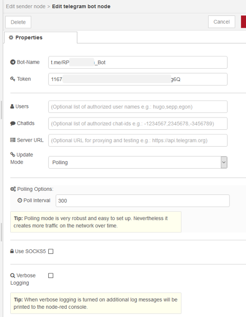
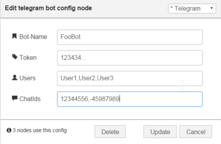
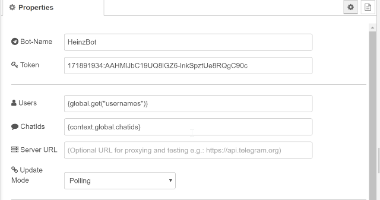
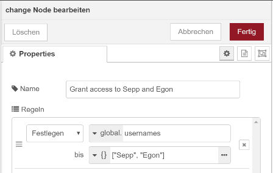
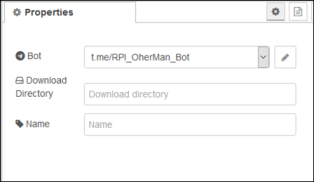
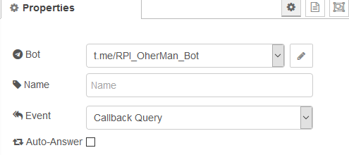
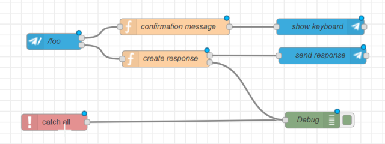
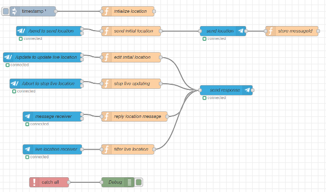

| [На головну](../) | [ < Розділ > ](README.md) |
| ----------------- | ------------------------- |
|                   |                           |

# Бібліотека для роботи з Telegram ([node-red-contrib-telegrambot](https://flows.nodered.org/node/node-red-contrib-telegrambot)

Ця бібліотека містить вузли приймача і відправника, які виконують роль бота Телеграм. Єдине, що потрібно - це маркер, який можна отримати у бота @botfather. З процедурою створення телеграм бота можете ознайомитися за [даним посиланням](https://pupenasan.github.io/ProgIngContrSystems/%D0%94%D0%BE%D0%B2%D1%96%D0%B4%D0%BD%D0%B8%D0%BA%D0%B8/bot.html). 

Загальний опис роботи з ботом описаний [за посиланням](https://core.telegram.org/bots#keyboards)

Повний API для Телеграм-бота описаний за [посиланням](https://core.telegram.org/bots/api)

## Вузли

Вхідний вузол приймає повідомлення від бота та надсилає об’єкт message із таким змістом:

  `msg.payload` містить властивості повідомлення

- **chatId**: унікальний ідентифікатор чату. Це значення потрібно передати у вихідний вузол, відповідаючи на той самий чат.
- **тип**: тип отриманого повідомлення: message, photo, audio, location, video, animation, voice, contact (повідомлення, фото, аудіо, місцезнаходження, відео, анімація, голос, контакт)
- **вміст**: вміст отриманого повідомлення: рядок або `file_id,` або об’єкт із повними даними (місцезнаходження, контакт)

`msg.originalMessage` містить оригінальний об'єкт повідомлення з базової області [node-telegram-bot-api](https://github.com/yagop/node-telegram-bot-api).

Вихідний вузол відправляє вміст у визначений чат. Простий потік ехо виглядає так:


### Конфігураційний вузол

Вузол конфігурації спілкується з сервером Telegram. Не створюйте декілька вузлів конфігурації з одним і тим же маркером! 

Тут обов'язково потрібно вводити тільки маркер (token), який ви отримали від `@botfather` при створенні нового бота та його ім'я. 



Вузол містить дві необов’язкові властивості: `users` (користувачі) та `chatids`(ідентифікатори чатів). Ви можете ввести список імен та/або chatids, які мають право використовувати цей бот. Це корисно, якщо бот повинен приймати вхідні виклики лише від спеціалістів. Значення в полях властивостей повинні бути розділені через кому (`,`) наприклад: `Hugo, Sepp, Egon` . Залиште поля порожніми, якщо ви не хочете використовувати цю функцію. 

`saveDataDir` (???)- необов'язкове значення конфігурації, яке можна встановити для автоматичного завантаження всього вмісту, як-от музика, відео, анімація, документи тощо. 

Прапор `Verbose Logging` повинен бути активований лише під час налагодження мережевих проблем, оскільки це створить циклічні попередження, коли мережа буде відключена.

За замовчуванням бот опитує кожні 300 мс для читання нових повідомлень (`Update mode` = `polling`). Але ви також можете скористатися методом `webhook`, щоб уникнути опитування. Це описано нижче.

#### Налаштування захисту

Вузол конфігурації містить дві властивості для застосування безпеки до вашого бота. Ви можете вибрати між налаштуванням вибраних імен користувачів або налаштувати один або кілька чатів, яким дозволено отримати доступ до бота. Значення мають бути розділені за допомогою коми, як показано на рисунку.



**Примітка**: chat-ids для чатів, в яких ви спілкуєтесь з ботом, один на один додатні. Від'ємний ідентифікатор чату вказує на груповий чат. Усі в цій групі можуть використовувати бот, якщо ви вводите chat-id групи у відповідному полі вузла конфігурації.

#### Динамічна авторизація 

Якщо ви хочете авторизувати та несанкціонувати користувачів або чати під час виконання, ви можете вставити скрипт у конфігурацію замість жорсткого кодованого списку. Сценарій починається з `{` і закінчується `}`. Взагалі кажучи, ви можете використовувати контекст двома способами (наприклад, у функціональному вузлі):

1. `context.global.maykey = myvalue; // = old notation`
2. `global.set(mykey, myvalue); // = new notation`

У контекстному вікні браузера можна побачити лише останнє, тоді як перше зберігається лише як змінна в пам'яті. Для використання динамічного списку, що зберігається в контексті, ви повинні додати сценарій до конфігурації (у рядку `Users` та/або `ChatIds`):

1. `{context.global.hereyourkey}` для першого підходу
2. `{gobal.get("hereyoukey")}` для другого підходу

Якщо конфігурація починається з `{` і закінчується `}`, вираження оцінюється як сценарій. Наприклад, ви можете написати щось подібне

```javascript
{context.global.username}
{context.global.chatids}
```

або

```javascript
{global.get("usernames")}
{global.get("chatids")}
```

Я б рекомендував використовувати останнє позначення.



Авторизацію можна змінити за допомогою вузла зміни:



В якості альтернативи авторизацію можна змінити, використовуючи функціональний вузол:

```javascript
// classic aproach for using context.
context.global.usernames = [ "User" ];
context.global.chatids = [ 1 ];
return msg;
```

(не те, що ви також можете використовувати функціональний вузол з новою нотацією, наприклад `global.set` (ключ, значення).

 [dynamic authorization flow](https://github.com/windkh/node-red-contrib-telegrambot/tree/master/examples/dynamicauthorization.json)

#### Використання webhook замість періодичного опитування

Перед цим потрібно створити власний сертифікат, як описано [тут](https://core.telegram.org/bots/webhooks https://stackoverflow.com/questions/42713926/what-is-easy-way-to-create-and-use-a-self-signed-certification-for-a-telegram-we ) Одним із багатьох підводних каменів під час створення сертифікатів (які не працюють) є те, що значення CN, яке ви надали для `openssl`, повинно відповідати доменному імені ботів: див. "bot host" вище.

Створіть нашу пару приватних та відкритих ключів, скориставшись такою командою: Важливо: замініть `SERVER_NAME_OR_IP` на ім’я, яке ви вводите у вузлі конфігурації у розділі "Webhook Bot Host". Обидва імена повинні бути однаковими, інакше сервер телеграми не надсилатиме оновлення вашому боту. Ви також повинні замінити `YOUR_NAME_OR_COMPANY_NAME` деяким значенням. Зауважте, що термін дії сертифікату закінчується через 365 днів.

```shell
openssl req -newkey rsa:2048 -sha256 -nodes -keyout PRIVATE.key -x509 -days 365 -out PUBLIC.pem -subj "/C=NG/ST=Lagos/L=Lagos/O=YOUR_NAME_OR_COMPANY_NAME/CN=SERVER_NAME_OR_IP"
```

Webhook також можна використовувати без сертифіката, але тоді bot host повинен бути за тунелем, див. [посилання](https://github.com/windkh/node-red-contrib-telegrambot/pull/93)

Підтримка проксі-сервера SOCKS5 необов’язкова, коли працює за проксі-сервером SOCKS5, який вимагає аутентифікації.

### Receiver 

Цей вузол отримує всі повідомлення з чату. Просто запросіть бота на чат. (Ви можете контролювати, чи бот отримує кожне повідомлення, викликавши `/setprivacy @botfather`) 



Оригінальне повідомлення з базової бібліотеки вузлів зберігається у `msg.originalMessage`. `msg.payload` містить найважливіші дані, такі як

- `chatId`, 
- `type` (тип ) 
- `content` (вміст).
- `messageID`


Вміст залежить від типу повідомлення. Наприклад, якщо ви отримуєте повідомлення, то вміст - це рядок. Якщо ви отримаєте місцеположення, то вміст - це об'єкт, що містить широту та довготу. Другий вихід спрацьовує, коли застосовується захист і користувач не має права доступу до бота. Дивись нижче.

Коли вузол приймача отримує такі дані, як відео, документи тощо, файл завантажується автоматично на локальний жорсткий диск, коли в вузлі конфігурації встановлено `saveDataDir`. Каталог також є частиною завантаження повідомлення: `msg.payload.path` Крім того, повідомлення містить пряме посилання для завантаження у корисному навантаженні: `msg.payload.weblink`

Можуть бути отримані повідомлення наступних типів (див output object):

- `message` - content is text
- `photo` - content is the file_id of the photo with the highest  resolution (all photos are stored in the photos property of the output  object)
- `audio` - content is the file_id of the audio file
- `document` - content is the file_id of the document
- `sticker` - content is the file_id of the sticker
- `animation` - content is the file_id of the animation file
- `video` - content is the file_id of the video file
- `video_note` - content is the file_id of the video note file
- `voice` - content is the file_id of the voice file
- `location` - content is an object with latitude and longitude
- `venue` - content is the venue object
- `contact` - content is the contact information object Note that media groups are received not as group, but as separate messages of type photo and video. 

Наступні типи вказують на зміни в самій групі або каналі.

- `new_chat_title` - content is the new chat title
- `new_chat_photo` - content is the file_id (see photo)
- `new_chat_members` - content is an array of new chat members
- `left_chat_member` - content is an object describing the chat member that left
- `delete_chat_photo` - content is true
- `pinned_message` - content is the pinned message object
- `channel_chat_created` - 
- `group_chat_created` - 
- `supergroup_chat_created` - 
- `migrate_from_chat_id` - content is the chat id. The chat property describes the chat.
- `migrate_to_chat_id` - content is the chat id. The chat property describes the chat.

### Sender 

Цей вузол відправляє корисне навантаження в чат.


 Корисне навантаження (`payload` ) повинно містити такі поля:

- `msg.payload.chatId` - `chatId` або масив `chatIds`, якщо ви хочете надіслати те саме повідомлення багатьом чатам
- `msg.payload.type` - наприклад, `message`
- `msg.payload.content` - текст повідомлення
- `msg.error` - встановлюється, коли стався виняток
- `msg.payload.options` - додаткові необов'язкові  аргументи які передаються

Поряд з надсиланням вмісту, вузол відправника може використовуватися для видачі прямих команд до API. Тип `msg.payload.type` повинен бути встановлений на одне із наведених вище, `msg.payload.content` містить необхідні аргументи, тоді як додаткові аргументи передаються у `msg.payload.options` (див. Приклади, а також [опис API](https://core.telegram.org/bots/api#sendmessage)). 

Нижче наведена відповідна таблиця з API:

| Parameter                | Type                                                         | Required | Description                                                  |
| ------------------------ | ------------------------------------------------------------ | -------- | ------------------------------------------------------------ |
| chat_id                  | Integer or String                                            | Yes      | Unique identifier for the target chat or username of the target channel (in the format `@channelusername`) |
| text                     | String                                                       | Yes      | Text of the message to be sent, 1-4096 characters after entities parsing |
| parse_mode               | String                                                       | Optional | Mode for parsing entities in the message text. See [formatting options](https://core.telegram.org/bots/api#formatting-options) for more details. |
| disable_web_page_preview | Boolean                                                      | Optional | Disables link previews for links in this message             |
| disable_notification     | Boolean                                                      | Optional | Sends the message [silently](https://telegram.org/blog/channels-2-0#silent-messages). Users will receive a notification with no sound. |
| reply_to_message_id      | Integer                                                      | Optional | If the message is a reply, ID of the original message        |
| reply_markup             | [InlineKeyboardMarkup](https://core.telegram.org/bots/api#inlinekeyboardmarkup) or [ReplyKeyboardMarkup](https://core.telegram.org/bots/api#replykeyboardmarkup) or [ReplyKeyboardRemove](https://core.telegram.org/bots/api#replykeyboardremove) or [ForceReply](https://core.telegram.org/bots/api#forcereply) | Optional | Additional interface options. A JSON-serialized object for an [inline keyboard](https://core.telegram.org/bots#inline-keyboards-and-on-the-fly-updating), [custom reply keyboard](https://core.telegram.org/bots#keyboards), instructions to remove reply keyboard or to force a reply from the user. |

- `editMessageCaption`
- `editMessageText`
- `editMessageReplyMarkup`
- `deleteMessage`
- `editMessageLiveLocation`
- `stopMessageLiveLocation`
- `callback_query`
- `inline_query`
- `action`
- `leaveChat`
- `kickChatMember`
- `unbanChatMember`
- `restrictChatMember`
- `promoteChatMember`
- `exportChatInviteLink`
- `setChatPhoto`
- `deleteChatPhoto`
- `setChatTitle`
- `setChatDescription`
- `pinChatMessage`
- `unpinChatMessage`
- `getChatAdministrators`
- `getChatMembersCount`
- `getChat`
- `getChatMember`

Опис API для даної команди доступне [за посиланням](https://core.telegram.org/bots/api#sendmessage). 

#### Додаткові опції при відправці повідомлень.

Текстові повідомлення можуть бути у форматі розмітки для підтримки жирного та курсивного стилів. Щоб увімкнути формат розмітки, встановіть властивість параметрів `parse_mode` таким чином:

```javascript
msg.payload.options = {parse_mode : "Markdown"};
```

Telegram завжди додає попередній перегляд, коли ви надсилаєте веб-посилання. Ви можете відключити попередній перегляд, встановивши властивість параметрів таким чином:

```javascript
msg.payload.options = {disable_web_page_preview : true};
```

Відповідь на запит зворотного виклику має опцію `show_alert` для контролю видимості відповіді на клієнті. Це безпосередньо відображено у властивості параметрів.

```javascript
msg.payload.options = true;
```

#### Як узнати `chat_id` групи?

Для того, щоб отримати `chat_id` групи треба бота добавити в групу і отримати з неї хоча б одне повідомлення. Там буде вказано ідентифікатор чату. Однак за замовченням, у  групах боти не отримують повідомлення, якщо вони не командні. Це так званий [privacy mode](https://core.telegram.org/bots#privacy-mode). Цей режим можна відключити за допомогою `@BootFather` зайшовши в меню редагування.    

### Command 

Цей вузол можна використовувати для ініціювання передачі message при отриманні заданої команди: наприклад help. Дивіться приклад нижче. Він має два виходи

1. спрацьовує при отриманні команди
2. спрацьовує, на наступний цикл після відповіді на команду 


​	Другий корисний, коли потрібно використовувати клавіатуру. Дивіться приклад нижче. Команди зазвичай починаються з `/` як, наприклад, `/foo`. Відповідно до документації Телеграми api команда повинна бути видана за назвою бота, як `/foo@YourBot`. Це важливо, коли ви додаєте кілька різних ботів до одного групового чату. Щоб уникнути того, що бот обробляє команди, які безпосередньо йому не надсилаються, використовуючи довгу нотацію, ви можете встановити "суворий" режим в параметрах командного вузла (`strict in group chats`). У цьому випадку бот приймає лише повні позначення команд у групових чатах.
​	Другий вихід видається лише в тому випадку, якщо команда була отримана перед цим. Якщо тим часом був запущений інший показник, очікуваний статус першого відновлюється. Стан зберігається на користувача та в чаті.

### Event 

Вузол отримує події від бота на зразок:

- `callback_query` of inline keyboards. See example-flow [inline keyboard flow](https://github.com/windkh/node-red-contrib-telegrambot/tree/master/examples/inlinekeyboard.json) in examples folder.
- `inline_query`
- `edited_message` which is triggered when someone alters an already sent message.
- `edited_message_text` which is triggered when someone alters an already sent message text.
- `edited_message_caption` which is triggered when someone alters an already sent caption e.g. of a photo.
- `channel_post` which is triggered when the bot is member of a public channel (/setprivacy to disabled!).
- `edited_channel_post` which is triggeren when someone alters an already sent message in a public channel.
- `edited_channel_post_text` which is triggeren when someone alters an already sent message text in a public channel.
- `edited_channel_post_caption` which is triggeren when someone alters an already sent caption of e.g. a photo in a public channel.



### Reply 

Вузол відповіді чекає відповіді на вказане повідомлення. Його слід використовувати разом із вузлом `Sender`. 

Див. Приклад нижче.

Поруч із клавіатурою бот також може задати питання і чекати відповіді. Коли користувач відповідає на вказане повідомлення, може бути використаний вузол `reply` :

 

###### Create question

```javascript
msg.payload.type = 'message';
msg.payload.content = 'Really?';
msg.payload.options = {reply_to_message_id : msg.payload.messageId}
return [ msg ];
```

Питання надсилається до чату. Цей вузол запускає вузол відповіді в очікуванні відповіді.

**Примітка**: користувач повинен явно відповісти на це повідомлення (типу з коментарем). Якщо користувач записує лише якийсь текст, вузол не буде спрацьовувати.

###### switch answer

```javascript
if (msg.payload.content === 'Yes') {return [msg, null];}
else {return [null, msg];} 
```

Остання функція показує, як оцінити відповідь за допомогою вузла функції з двома виходами.

## Приклади

### Реалізація команди  `/help` 

Цей потік повертає довідкове повідомлення вашого бота. Він отримує команду і створює нове повідомлення, яке повертається:


```javascript
var helpMessage = "/help - shows help\r\n";
helpMessage += "/foo - opens a dialog\r\n";

helpMessage += "\r\n";
helpMessage += "You are welcome: "+ msg.originalMessage.from.first_name + " " + msg.originalMessage.from.last_name;
helpMessage += "Your chat id is " + msg.payload.chatId;
helpMessage += "\r\n";

msg.payload.content = helpMessage;
return msg;
```

**Примітка**: Ви можете отримати доступ до даних відправника через властивість `originalMessage`.

### Реалізація клавіатури (keyboard)

Клавіатури дуже корисні для отримання додаткових даних від відправника. Після отримання команди запускається перший вихід і відкривається діалогове вікно:

 

```javascript
context.global.keyboard = {pending : true};

var opts = {
    reply_to_message_id: msg.payload.messageId,
    reply_markup: JSON.stringify({
        keyboard: [
            ['Yes'],
            ['No']],
        	'resize_keyboard' : true,
        	'one_time_keyboard' : true
    })
};
msg.payload.content = 'Really?';
msg.payload.options = opts;
return [msg];
```

Відповідь надсилається на другий вихід, запускаючи нижній потік. Тут передаються дані через глобальні властивості.

```javascript
if (context.global.keyboard.pending)
    {
        context.global.keyboard.pending = false;
        
        if(msg.payload.content === 'Yes')
            {
                msg.payload.content = 'Yes';
                return [msg, null];
            }
        else
            {
                msg.payload.content = 'No';
                return [null, msg];
            }
    }
```

Заповнення полів читайте в [описі API](https://core.telegram.org/bots/api/#replykeyboardmarkup).

### Реалізація inline-клавіатури 

Вбудована клавіатура містить кнопки, які можуть надсилати запит зворотного виклику назад до бота, щоб викликати будь-яку функцію. Коли команда отримана, спрацьовує перший вихід і відображається вбудована клавіатура:


 [inlinekeyboard flow](https://github.com/windkh/node-red-contrib-telegrambot/tree/master/examples/inlinekeyboard.json)

###### inline keyboard message

```javascript
var opts = {
  reply_to_message_id: msg.payload.messageId,
  reply_markup: JSON.stringify({
    "inline_keyboard": [[
                {
                    "text": "Yes",
                    "callback_data": "FOO YES"            
                }, 
                {
                    "text": "No",
                    "callback_data": "FOO NO"            
                }]
            ]
  })
};
msg.payload.content = 'Are you sure?';
msg.payload.options = opts;
return [ msg ];
```

Запит зворотного виклику отримує вузол події (`Event`). На нього потрібно відповісти наступним чином: 

###### set  answer options

```javascript
var show_alert = false; // ви можете встановити це значення true, щоб відкрити діалогове вікно з відповіддю у клієнта.

// msg.payload.content вміщує дані callback для клавіатури
// Ви можете змінити це значення тут 
msg.payload.options = show_alert;

return [ msg ];
```

тут ви можете додати свій код, щоб запустити бажану команду бота. Відповідь містить дані запиту зворотного виклику у `msg.payload.content`.

### Редагування в inline клавіатурі

Вбудовану клавіатуру можна змінити, використовуючи інструкцію `editMessageReplyMarkup`. Щоб мати змогу змінити існуюче повідомлення, вам потрібно знати `messageId` повідомлення клавіатури. Зразковий потік надається в папці з прикладами і може виглядати так:

 

[editinlinekeyboard flow](https://github.com/windkh/node-red-contrib-telegrambot/tree/master/examples/editinlinekeyboard.json)

###### initial inline keyboard message

```javascript
context.global.keyboard = { messageId : msg.payload.messageId };
var opts = {
  reply_to_message_id: msg.payload.messageId,
  reply_markup: JSON.stringify({
    "inline_keyboard": [[
                {
                    "text": "Yes",
                    "callback_data": "FOO YES"            
                }, 
                {
                    "text": "No",
                    "callback_data": "FOO NO"            
                }]
            ]
  })
};
msg.payload.content = 'Do you want to hide the inline keyboard?';
msg.payload.options = opts;
return [ msg ];
```

Ідентифікатор повідомлення `message id` потрібно зберегти у потоці чи глобальному контексті. Це лише демонстрація, яка припускає, що є лише один чат.

###### save messageId

```javascript
// We store the messageId to be able to edit this reply in the callback query. 
context.global.keyboard.messageId = msg.payload.sentMessageId;
return [ msg ];
```

Замініть початкову клавіатуру модифікованою, використовуючи магічну команду `editMessageReplyMarkup`.

###### edit inline keyboard message

```javascript
// This is the message id of the initial keyboard that is simply exchanged by a new one.
var messageId = context.global.keyboard.messageId;
// This is a sample of how to send a second inline keyboard with modified buttons
var reply_markup = JSON.stringify({
    "inline_keyboard": [[
                {
                    "text": "Are you really sure?",
                    "callback_data": "FOO YES REALLY"            
                }, 
                {
                    "text": "No",
                    "callback_data": "FOO NO"            
                }]
            ]
  });
var options = {
    chat_id : msg.payload.chatId,
    reply_markup : reply_markup,
    message_id : messageId
};
msg.payload.type = 'editMessageReplyMarkup';
msg.payload.content = reply_markup;
msg.payload.options = options;
return [ msg ];
```

Наступний вузол `switch` просто обробляє відповідь і приховує клавіатуру за допомогою іншої магічної команди: `deleteMessage`

```javascript
// This is a sample switch to demonstrate the handling of the user input.
if(msg.payload.content === "FOO YES REALLY")
{
    // Hide the keyboard and forget the messageId
    msg.payload.type = 'deleteMessage';
    msg.payload.content = context.global.keyboard.messageId
    context.global.keyboard.messageId = null;    
    // You could also send a editMessageReplyMarkup with an empty reply_markup here
    return [ null, msg ];
}
else
{
    var show_alert = false; // you can set this to true to open a dialog with the answer in the client.
    // msg.payload.content contains the callback data from the keyboard.
    // You may change this value here.
    msg.payload.options = show_alert;
    return [ msg, null ];
}
```

Як альтернативу `editMessageReplyMarkup` ви також можете використовувати `editMessageText` для заміни клавіатури, а також тексту наступним чином:

```javascript
// This is the message id of the initial keyboard that is simply exchanged by a new one.
var messageId = context.global.keyboard.messageId;

// This is a sample of how to send a second inline keyboard with modified buttons
var reply_markup = JSON.stringify({
    "inline_keyboard": [[
                {
                    "text": "Are you really sure?",
                    "callback_data": "FOO YES REALLY"            
                }, 
                {
                    "text": "No",
                    "callback_data": "FOO NO"            
                }]
            ]
  });


var options = {
    chat_id : msg.payload.chatId,
    reply_markup : reply_markup,
    message_id : messageId
};

msg.payload.type = 'editMessageReplyMarkup';
msg.payload.content = reply_markup;
msg.payload.options = options;

return [ msg ];

```

### Реалізація inline_query

Ботів можна викликати з будь-якого чату через `inline_query`, коли бот встановлений на вбудований режим в botfather через `/setinline`, див. [посилання](Https://core.telegram.org/bots/api#inline-mode) Приклад потоку може виглядати так:

  

[inlinequery flow](https://github.com/windkh/node-red-contrib-telegrambot/tree/master/examples/inlinequery.json)

На відповідь `inline_query` слід відповісти, надсилаючи масив результатів. див. [посилання](https://core.telegram.org/bots/api#inlinequeryresult)  Приклад лише повертає дві прості статті, але майже кожен тип вмісту може бути повернутий.

###### create results

```javascript
// we have to set the results propery with the answer(s)
// see https://core.telegram.org/bots/api#inlinequeryresult
var results = [
    // result 1 is InlineQueryResultArticle
    {
        type : "article",
        id : "1",
        title : "Result 1",
        
        // InputTextMessageContent see https://core.telegram.org/bots/api#inputmessagecontent
        input_message_content : {
            message_text : "The message 1",
            parse_mode : "Markdown",
            disable_web_page_preview : true
        }
    },
    
    // result 2 is InlineQueryResultArticle
    {
        type : "article",
        id : "2",
        title : "Result 2",
        
        // InputTextMessageContent see https://core.telegram.org/bots/api#inputmessagecontent
        input_message_content : {
            message_text : "The message 2",
            parse_mode : "Markdown",
            disable_web_page_preview : false
        }
    }
    ];

msg.payload.results = results;
return msg;
```

Зауважте, що запит `inline_query` також може містити місцезнаходження відправника. Щоб увімкнути цей виклик `/setinlinegeo` у `@botfather`

### Отримання місцеположення

Місцеположення можна надіслати до чату. Бот може отримувати довготу і широту:

```javascript
if (msg.payload.type == 'loation')
    {
        var lat = msg.payload.content.latitude;
        var lng = msg.payload.content.longitude;
        
        msg.payload.type = 'message';
        msg.payload.content = 'lat=' + lat + ' lon=' + lng;
        return msg;
    }
else
    {
        return null;
    }
```

### Відправка повідомлення до вказаного чату

Якщо у вас є `chatId`, ви можете надіслати будь-яке повідомлення без необхідності отримувати щось до цього.

```javascript
msg.payload = {chatId : -476404242, type : 'message', content : 'ping'}
return msg;
```

 [sendmessagetochat flow](https://github.com/windkh/node-red-contrib-telegrambot/tree/master/examples/sendmessagetochat.json)

### Відправка фото, відео ...

Поряд з надсиланням текстових повідомлень ви можете надсилати майже будь-який вміст, наприклад фотографії та відео. Встановіть правильний тип та зміст. Якщо ви хочете відповісти на отримане повідомлення із зображенням, ви можете написати:

```javascript
msg.payload.content = 'foo.jpg';
msg.payload.type = 'photo';
```

**Примітка**: chatId є правильним, коли ви повторно використовуєте отриманий msg-об’єкт із вузла приймача.

Ви можете використовувати один із наступних типів, щоб надіслати файл як вміст:

- [photo](https://github.com/windkh/node-red-contrib-telegrambot/tree/master/examples/sendphoto.json)
- audio
- video
- video_note
- sticker
- animation
- voice
- document 

Зауважте, що деякі клієнти перетворюють gif-анімацію у відео. Це призведе до проблем при передачі отриманого об’єкта анімації до вузла відправника, оскільки вміст є `mp4` замість `gif`. Вміст можна автоматично завантажити в локальну папку, встановивши запис `saveDataDir` у вузлі конфігурації. Ви можете додати підпис до фотографії, аудіо, документа, відео, анімації, голосу, встановивши властивість підписів таким чином:

```javascript
msg.payload.caption = "You must have a look at this!";
```

Для таких типів потрібен спеціальний формат вмісту. Детальнішу інформацію див. у API.

- location
- contact
- venue
- mediaGroup

 

```javascript
msg.payload.content = 'foo.jpeg';
msg.payload.type = 'photo';

/* type can be one of the following
photo
audio
video
sticker
voice
document
*/

return msg;
```

### Відправка `mediaGroup` як альбом 

Щоб надіслати кілька фотографій як альбом, ви можете використовувати `mediaGroup`. Для типу медіагрупи потрібно встановити вміст масиву типу об’єктів [InputMediaPhoto](https://core.telegram.org/bots/api#inputmediaphoto). Перегляньте Json нижче.

```javascript
msg.payload = {
    "chatId": 123456789,
    "messageId": 1,
    "type": "mediaGroup",
    "content": [
        {
            "type": "photo",
            "media": "/pic/frame_1.jpg"
        },
        {
            "type": "photo",
            "media": "/pic/frame_2.jpg"
        },
        {
            "type": "photo",
            "media": "/pic/frame_3.jpg"
        },
        {
            "type": "photo",
            "media": "/pic/frame_4.jpg"
        }
    ]
}
```

[sendmediagroup flow](https://github.com/windkh/node-red-contrib-telegrambot/tree/master/examples/sendmediagroup.json)

### Відправка контактів 

Надсилання контакту обмежується полями, які підтримуються базовим API, на `phone_number` та `first_name`. Але ви також можете отримати `last_name`, якщо клієнт надішле його.

```javascript
msg.payload.type = 'contact';
msg.payload.content : {  phone_number: "+49 110", first_name: "Polizei" };
```

 

[sendcontacttochat flow](https://github.com/windkh/node-red-contrib-telegrambot/tree/master/examples/sendcontacttochat.json)

```javascript
msg.payload = 
{
    chatId : 12345,
    type : "contact",
    content : 
    {
        phone_number: "+49 110",
        first_name: "first",
        last_name: "last"
    },
    options :
    {
        disable_notification : true
    }
}
return msg;
```

### Відправка дій чату

Коли боту потрібен певний час для подальшої обробки, але ви хочете дати підказку користувачеві, що відбувається, ви можете надіслати чат, який з’явиться у верхній частині каналу приймача.

```javascript
msg.payload.type = 'action';
msg.payload.content = "typing";
```

Зміст може бути одним із наступних

- `typing` for text messages
- `upload_photo` for photos
- `record_video` or `upload_video` for videos
- `record_audio` or `upload_audio` for audio files
- `upload_document` for general files
- `find_location` for location data
- `record_video_note` or `upload_video_note` for video notes

Наступний приклад ілюструє, як надіслати, наприклад, `typing`("набір тексту ..."). Звичайно, справжній бот надсилає реальні дані після закінчення обробки, але це не є частиною прикладу.

[sendchataction flow](https://github.com/windkh/node-red-contrib-telegrambot/tree/master/examples/sendchataction.json)

### Відправка місцеположення в реальному часі

Місцеположення можна надіслати в чат, як описано вище, а потім оновити: оновлення місцезнаходження в реальному часі. Щоб досягти цього, вам потрібно надати параметр `live_period` у секундах у опціях при відправці місця.

```javascript
msg.payload.type = 'location';
msg.payload.content = {
    latitude : lat,
    longitude : lng
};

msg.payload.options = {
    live_period : time
};
```

Щоб мати можливість оновити це місцеположення, вам потрібно зберегти ідентифікатор цього відправленого повідомлення. Це можна зробити, зберігаючи його десь у контексті потоку наступним чином:

```javascript
var messageId = msg.payload.sentMessageId;
flow.set("messageId", messageId);
```

Тепер ви можете редагувати місце розташування так часто, як вам потрібно з періодичністю `live_period`:

```javascript
var messageId = flow.get("messageId");
var chatId = msg.payload.chatId;

msg.payload.type = 'editMessageLiveLocation';
msg.payload.content = {
    latitude : lat,
    longitude : lng
};

msg.payload.options = {
    chat_id : chatId,
    message_id : messageId
};
```

Якщо ви хочете скасувати оновлення місця, ви можете надіслати команду `stopMessageLiveLocation`.

```javascript
var messageId = flow.get("messageId");
var chatId = msg.payload.chatId;

msg.payload.type = 'stopMessageLiveLocation';
msg.payload.options = {
    chat_id : chatId,
    message_id : messageId
};
```

 [livelocation flow](https://github.com/windkh/node-red-contrib-telegrambot/tree/master/examples/livelocation.json)

### Receiving live location updates

When a user sends his location then it is received by the standard message receiver node. But when a live location is updated, then you will receive the same message event as one would edit an already existing message in the chat (edit_message). The example above contains an event handler node that receives those message edits, and filters for the ones that contain a location.

### Forwarding message

All types of  messages can be forwarded to another chat (see forwardMessage). Just send a message to the sender node and add forward property to the payload. The forward object must contain the id of the chat the message should be sent to. In the following example the received message will be forwarded to the chat 1:

```javascript
msg.payload.forward = { chatId : 1 };
return msg;
```

See example-flow [forward message](https://github.com/windkh/node-red-contrib-telegrambot/tree/master/examples/forwardmessage.json) in examples folder.

The message id to forward is taken from: msg.payload.messageId.  The source chat id is taken from: msg.payload.chatId. Both properties are set by the receiver node, but you can also manually set those manually without having received anything. The following example sends message 2 from chat 1 to chat 3 (if you have sufficient permissions).

```javascript
msg.payload.chatId = 1;
msg.payload.messageId = 2;
msg.payload.forward = { chatId : 3 };
return msg;
```


### Виявлення неавторизованого доступу

Вузол приймача має другий вихід, який спрацьовує, коли авторизація не працює. Повідомлення надсилається на цей вихід для подальшої обробки. Ви можете відповісти на це повідомлення або записати його у файл, щоб побачити, хто хотів отримати доступ до вашого бота.

 

Повідомлення потрібно відформатувати до того, як можна буде запустити вузол журналу у файл. Проста функція може виглядати так:

```javascript
var chatId = msg.payload.chatId;
var username = msg.originalMessage.from.username;
msg.originalMessage.timestamp = new Date();
var message = JSON.stringify(msg.originalMessage);

msg.topic = username + ' ' + chatId;
msg.payload = [msg.topic, message];
return msg;
```

 [unauthorizedaccess flow](https://github.com/windkh/node-red-contrib-telegrambot/tree/master/examples/unauthorizedaccess.json)


### Реалізація простого бота

Збираючи всі шматки разом, у вас буде простий бот, який реалізує деякі корисні функції.

 

All example flows can be found in the examples folder of this package.

###### confirmation message

```javascript
var opts = {
  reply_to_message_id: msg.payload.messageId,
  reply_markup: JSON.stringify({
    keyboard: [
      ['Yes'],
      ['No']],
      'resize_keyboard' : true, 
      'one_time_keyboard' : true
  })
};

msg.payload.content = 'Really?';
msg.payload.options = opts;

return [ msg ];
```

###### create response

```javascript
if(msg.payload.content === 'Yes')
{
    msg.payload.content = 'Yes';
    return [msg, null];   
}
else
{
    msg.payload.content = 'No';
    return [null, msg];   
}
```

###### create help text

```javascript
var helpMessage = "/help - shows help\r\n";
helpMessage += "/foo - opens a dialog\r\n";
helpMessage += "Your chat id is " + msg.payload.chatId;

helpMessage += "\r\n";
helpMessage += "You are welcome: "+msg.originalMessage.from.username;
helpMessage += "\r\n";

msg.payload.content = helpMessage;
return msg;
```

###### create location message

```javascript
if(msg.payload.type == 'location')
{
    var lat = msg.payload.content.latitude;
    var lng = msg.payload.content.longitude;
    
    msg.payload.type = 'message';
    msg.payload.content = 'lat=' + lat + ' lon=' + lng;
    return msg;
}
else
{
    return null;
}
```

###### send to specific chat

```javascript
msg.payload = {chatId : 138708568, type : 'message', content : 'ping'}
return msg;
```

