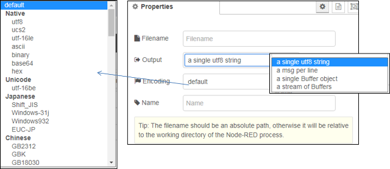

[<- На головну](../)  [Розділ](README.md)

## File in (читання з файлу)

Читає вміст файлу у вигляді рядку або бінарного буферу. На вхід подається ім’я файлу (filename з типом string) для читання (рис.4.1). Ім’я файлу також може бути вказано у конфігурації вузла

На вихід посилаються наступні властивості повідомлення:

- payload (string | buffer) – вміст     файлу як string або як binary buffer
- filename (string)     – якщо не сконфігуровано у властивостях вузлу, ця властивість вказує на     файл, що считувався

·     error (object) – застаріле, якщо в налаштуваннях вузла активована опція «Send message on error (legacy mode)», коли вузол виявляє помилку при читанні файлу, то відправить повідомлення без `payload`, і в цій властивості `error` буде встановлені деталі помилки. Цей режим поведінки застарілий і не включений за умовчанням для нових екземплярів вузла. До версії Node-RED 0.17, якщо в цьому вузлі виникала помилка під час читання файлу, він відправляв повідомлення без `msg.payload` та формував `msg.error` для деталізації помилки. Це застарілий режим поведінки для вузла, який в нових версіях не використовуються. Якщо потрібно, цей режим може бути явно включений в конфігурації вузла.
 Наразі помилки слід сприймати та обробляти за допомогою вузла Catch.

рис.4.1. Конфігурування вузла File in. 

Ім'я файлу має бути абсолютним шляхом, інакше він буде вважатися відносно робочого каталогу процесу Node-RED. У Windows може знадобитися вилучення сепараторів шляхів, наприклад:

 `\Users\myUser`.

За бажанням, вихід з вузла для текстового файлу можна розділити на рядки (a msg per line), виводячи одне повідомлення на рядок. Зчитування з бінарного файлу можна розділений на менші буферні фрагменти (stream of Buffers), розмір фрагменту залежить від операційної системи, але зазвичай 64k (Linux / Mac) або 41k (Windows).
 Якщо зчитаний файл розбивається на кілька частин-повідомлень, кожне з них матиме властивість `parts`, утворюючи цілісну послідовність повідомлень.