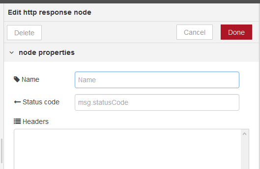

[<- На головну](../)  [Розділ](README.md)

## Http response (HTTP-сервер - формування вихідного повідомлення)

 Надсилає відповіді на запити, отримані від вузла HTTP Input (рис.8.3). 



рис.8.3. Налаштування Http response

В якості вхідного значення приймає наступні властивості повідомлень:

- `payload` (string) – тіло відповіді 
- `statusCode` (number) – якщо встановлений, використовується в якості статусного коду відповіді. За замовченням 200
- `headers` (object) – заголовки, якщо встановлений забезпечує HTTP заголовки, які     включаються у відповідь  
- `cookies` (object) – якщо встановлений, може бути використаний для встановлення або видалення куків     (cookies)

`statusCode` і `headers` також можуть бути встановлені в налаштуваннях самого вузла. У цьому випадку їх не можна перевизначити відповідними властивостями повідомлення.

Властивість `cookies` повинна бути об'єктом з парою імя/значення. Значення може бути або рядком для встановлення значення куки з параметрами за замовчуванням, або це може бути об'єктом опцій.

Наступний приклад встановлює два файли cookies - один з них називається `name` зі значенням `nick`, інший називається `session` зі значенням `1234` з терміном дії 15 хвилин.

```javascript
msg.cookies = {
    name: 'nick',
    session: {
        value: '1234',
        maxAge: 900000
    }
}
```

Допустимі опції:

- `domain` - (String) ім’я домену для куки 
- `expires` - (Date)  термін дії в GMT. Якщо не вказано або встановлено в 0, встановлюється куки для сесії
- `maxAge` - (String) термін дії відносно поточного часу в мілісекундах
- `path` - (String) шлях куки, за замовченням «/»
- `value` - (String) значення для куки 

Для видалення куки встановлюється в `null`