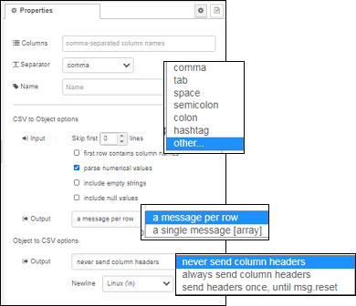

[<- На головну](../)  [Розділ](README.md)

## CSV

Перетворює рядки, відформатовані CSV в об’єкти JavaScript та навпаки.

На вхід подається значення `payload` тип  JavaScript object, array або рядок CSV.

На виході отримується також payload (*object | array | string*), який буде формуватися наступним чином: 

- Якщо вхідним значенням є string , він намагається розібрати його як CSV та створить JavaScript-об’єкт з парами ключ/значення для кожного рядка. Потім вузол буде надсилати повідомлення для кожного рядка, або одне повідомлення, що містить масив об'єктів.

- Якщо вхід є об’єктом JavaScript, він намагається побудувати CSV string.
- Якщо вхід є масивом простих значень, він будує однорядковий CSV string.
- Якщо вхід - це масив масивів або масив об’єктів, створюється багаторядковий (multiple-line) CSV string.

Шаблон стовпця (`columns`) може містити впорядкований список імен стовпців. При перетворенні CSV в об'єкт імена стовпців будуть використовуватися як імена властивостей. Крім того, назви стовпців можна взяти з першого ряду CSV. При перетворенні в CSV шаблон стовпця використовується для визначення, які властивості витягувати з об'єкта та в якому порядку. Якщо шаблон порожній, то вузол може використовувати простий список розділених комами властивостей, наданий у `msg.columns`, щоб визначити, що потрібно витягнути. Якщо цього немає, то всі властивості об'єкта виводяться в тому порядку, в якому вони знайдені.

Якщо вхід - це масив, то шаблон стовпців використовується лише для необов'язкового генерування рядів заголовків стовпців.

Якщо встановлено прапорець `parse numerical values`, числові значення рядків повертаються як числа, тобто середнє значення '1, "1.5", 2'. Якщо встановлено прапорець `include empty strings`, в результаті будуть повернуті порожні рядки, тобто середнє значення '"1", "", 3'. Якщо встановлено прапорець `include null values`, в результаті будуть повернуті нульові значення, тобто середнє значення '"1" ,, 3'.

Вузол може прийняти багаточастинний (multi-part) вхід, якщо властивість `parts` встановлено правильно, наприклад, з вузла вхідного файлу або вузла `split`. Якщо виводиться декілька повідомлень, вони матимуть властивість `parts` та формуватимуть повну послідовність повідомлень.

**Примітка:** шаблон стовпця (columns) повинен бути розділений комами, навіть якщо для даних обрано інший роздільник.

