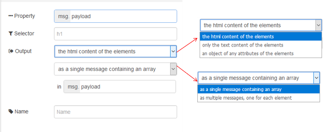
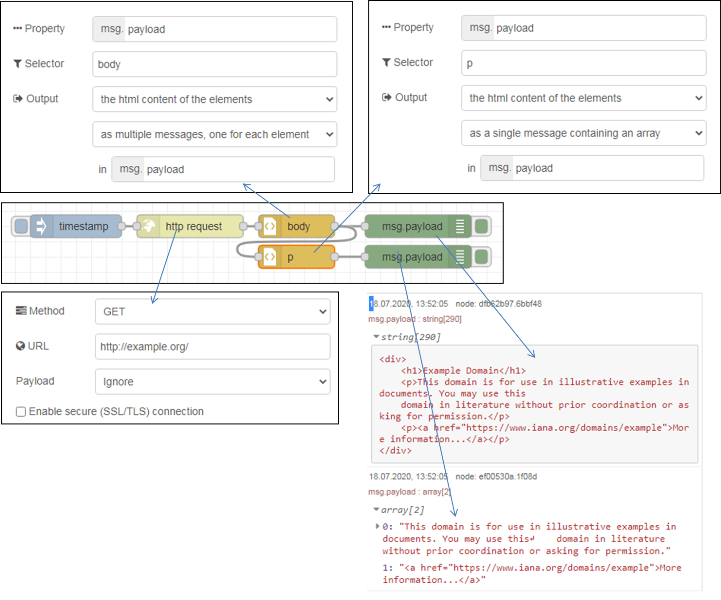

[<- На головну](../)  [Розділ](README.md)

## HTML

 Витягує елементи з HTML-документа, що міститься у вказаній властивості `msg`  за допомогою селекторів CSS (рис.10.1).

рис.10.1. Налаштування вузлу HTML

В якості вхідного значення приймає наступні властивості повідомлень:

- `payload` (string) -– html- рядок з якого вилучаються елементи.
- `select` (string) -- селектор, може бути використане це значення властивості `msg`, якщо воно не налаштовано на панелі редагування (в полі selector).

На виході формує:

- payload (array | string) - результатом може бути одне повідомлення з корисним навантаженням, що містить масив відповідних елементів, або кілька  повідомлень, кожен з яких містить відповідний елемент. Якщо надсилаються  декілька повідомлень, вони також мають набір `parts`.

Цей вузол підтримує комбінацію селекторів CSS і jQuery. Докладніше про підтримуваний синтаксис див. [тут](https://developer.mozilla.org/uk/docs/Web/CSS/CSS_Selectors) або [Документацію css-select](https://github.com/fb55/CSSselect#user-content-supported-selectors). 

Нижче наведений приклад використання HTML-парсера. Вузол `http request` робить запит на сторінку з сайту `example.org` використовуючи метод `get`. Сторінка завантажується в `Payload` як текстове повідомлення. Далі повідомлення проходить через вузол парсера `body`, який витягує html-зміст усіх html-тегів `body` та відправляє їх окремими повідомленнями в `payload`. Враховуючи, щ вузол `body` в html-документі тільки один, його зміст виводиться один раз на панелі налагодження. Корисне навантаження цього повідомлення переходить через інший html-парсер з іменем `p` де вилучаються усі абзаци ( тег `p`) і відправляються як масив повідомлень в форматі html.        

