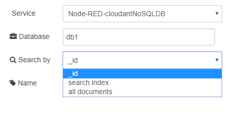

[<- На головну](../)  [Розділ](README.md)

## cloudant in (отримати документ з IBM Cloudant)

Вузол що дозволяє отримувати документи з бази даних Cloudant (рис.12.1).



рис.12.1.Налаштування вузлу cloudant in

Пошук документів може проводитися в трьох режимах: безпосередньо по **_id**, використовуючи існуючий [Пошуковий індекс](https://cloudant.com/for-developers/search/) або отримуючи усі документи, збережені в базі даних.

1. Якщо     використовується запит з опцією **_id**,     значення для документа `_id` повинно бути     вставлене `msg.payload` як string.
2. Для     використання існуючого **Пошукового     індексу,**  що збережений в потрібній базі даних, аргумент пошуку     повинен бути переданий в `msg.payload` як string  за шаблоном `indexName:value`. Майте на увазі, що індекс повинен     бути створений заздалегідь в базі даних, тут посилаються на його `design document/index name`. 

При запиті за допомогою пошукового індексу ви можете передавати параметри пошуку як об'єкт у `msg.payload`. Наприклад, ви можете передати такий об'єкт:

```json
{ query: "abc*", limit: 100 }
```

для зміни значення  `limit`. Ви можете знайти більше інформації про пошуковий індекс  [офіційній документації Cloudant](https://docs.cloudant.com/api.html?http#queries).

 

1. Останній     спосіб отримання документів полягає в тому, щоб просто отримати їх всі,     вибравши опцію **all documents**.
        Ім'я бази даних повинно відповідати цим     правилам:
        • Без пробілів
        • Всі літери маленькі 
        • Перший символ не може бути _