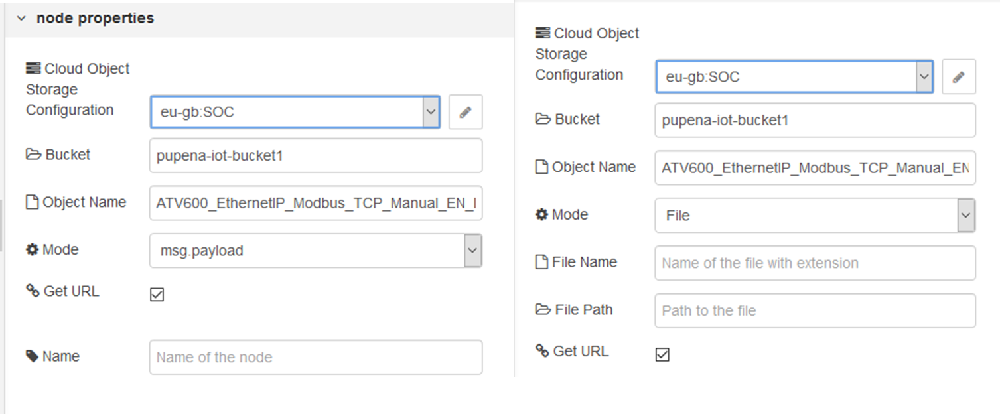

[<- На головну](../)  [Розділ](README.md)

## cos get (отримати об’єкт з IBM COS)

 Це вузол для отримання (GET) об’єкту з IBM Cloud Object Storage Service (S3). (рис.13.2) 

рис.13.2. Налаштування вузлу cos get

Вузол має входи:

- `payload (string | buffer)` – корисне навантаження, що ініціює читання 
- `bucket (string)`- bucket в якому знаходиться потрібний об’єкт 
- `objectname (string)` – унікальне ім’я збереженого файлу в Cloud Object     Storage Service.
- `mode (string)` – вказує чи зберігати об’єкт в файл.
- `filename (string)`  – ім’я файлу для перезапису.
- `filepath (string)`  – ім’я папки з файлом .
- `geturl (Boolean)`  – якщо необхідно отримати URL об’єкту, тоді     вказується `true`.

Вузол має виходи.

- Стандартні 

  - `payload (string)` – вузол повертає об’єкт в `msg.payload` або в `filename` якщо вибраний file-mode.
  - `objectname (string)` – Ім’я об’єкту `msg.objectname`.
  - `url (string)` – Якщо виставлена опція `msg.geturl`, то `msg.url` буде містити WebLink URL на об’єкт.

- Помилка 

  - `error (string)` – або `msg.error` з кодом помилки.

Поле `msg.objectname` повинно містити унікальне ім’я об’єкту який необхідно отримати з IBM Cloud Object Storage Service 

Якщо ви хочете отримати згенерований URL для об’єкту, необхідно виставити опцію HMAC.  Цей вузол використовує функцію S3-API IBM Cloud Object Storage Service. 

 