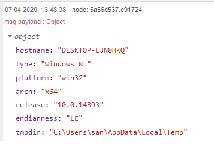
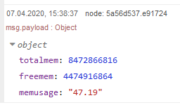
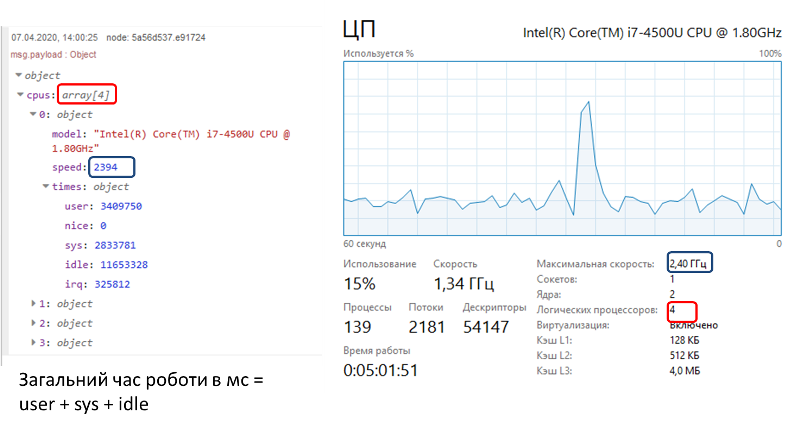
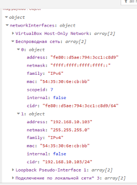

| [На головну](../) | [ < Розділ > ](README.md) |
| ----------------- | ------------------------- |
|                   |                           |

## Operating Systems (node-red-contrib-os)                   

[Джерело](https://flows.nodered.org/node/node-red-contrib-os)

Ці вузли використовують[Node.js OS Library](https://nodejs.org/api/os.html) для отримання основних функцій, пов'язаних з операційною системою. Автор [Jason D. Harper](https://github.com/jayharper)

### OS

 Використовуйте цей вузол для запиту в операційній системі.

- Повертає ім'я хоста операційної системи.

- Повертає ім'я операційної системи. Наприклад, "Linux" в Linux, "Darwin" в OS X і "Windows_NT" в Windows.

- Повертає платформу операційної системи. Можливі значення: "darwin", "freebsd", "linux", "sunos" або "win32".

- Повертає архітектуру процесора операційної системи. Можливі значення "x64", "arm" та "ia32".

- Повертає випуск операційної системи.

- Повертає endianness (порядок байт в словах) процесора. Можливі значення "BE" для  big endian або "LE" для little endian.

- Повертає каталог за замовчуванням для тимчасових файлів операційної системи.

### Memory

Використовуйте цей вузол для запиту пам’яті системи.

- Повертає загальний обсяг системної пам'яті в байтах.
- Повертає обсяг вільної системної пам'яті в байтах.
- Повертає пам'ять у використанні у відсотках.

### Uptime 

Повертає системний час роботи в секундах. 

### Loadavg

Повертає масив, що містить середнє значення для завантаження 1, 5 та 15 хвилин.

Середнє навантаження - це показник активності системи, обчислений операційною системою і виражений у вигляді дробу. Як правило, середня завантаженість в ідеалі повинна бути меншою, ніж кількість логічних процесорів у системі.

Середня навантаження - це UNIX-y концепція; на платформах Windows немає реального еквівалента. Ось чому цей вузол завжди повертає [0, 0, 0] у Windows.

### CPUs

Повертає масив об'єктів, що містить інформацію про кожен встановлений процесор/ядро: модель, швидкість (в МГц) та часи (об’єкт, що містить кількість мілісекунд, що процесор/ядро витратив на: користувацькі (user), nice, системні (sys), простоювання (idle) та irq).

Нижче наведений приклад виводу змісту повідомлення на debug та копія екрану з інформацією про ту ж систему на кілька хвилин пізніше. Сума усіх часів дає загальний результат про час роботи процесору.

### NetworkIntf

Використовуйте цей вузол, щоб отримати список мережевих інтерфейсів у системі. Зауважте, що завдяки базовій реалізації це поверне лише мережеві інтерфейси, яким було призначено адресу.

### Drives

Використовуйте цей вузол для запиту на жорсткі диски.

- Значення розміру, використаного та доступного значення виражаються в кілобайтах (1024 байти).

- Співвідношення для ємності - це число від 0 до 1. Ємність*100 також відома як використаний відсоток.

На Winodws 10 закрешилося.

| [На головну](../) | [ < Розділ > ](README.md) |
| ----------------- | ------------------------- |
|                   |                           |