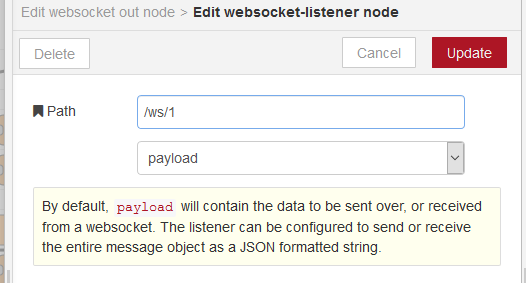

[<- На головну](../)

# Бібліотека WebSocket

- [WebSocket in](websocketin.md)
- [WebSocket out](websocketout.md)

## Налаштування клієнтських і серверних з’єднань 

Для налаштування серверного ресурсу WebSocket для Node-RED використовуються конфігураційні вузли WebSocket-listener (рис.9.1). Вхідний порт для з’єднання буде тим самим, що і порт для конфігурування/WEB, тобто типово, 1880. Тому в конфігураційному вузлі вказується тільки частина URI що вказує розміщення ресурсу на сервері.  

рис.9.1.Конфігураційний вузол WebSocket-listener

Для налаштування з’єднання клієнтського вузлу WebSocket з Node-RED використовуються конфігураційні вузли WebSocket-client (рис.9.2). Для означення схеми на початку URL вказується ws:// для звичайного або wss:// для захищеного з’єднання. Далі вказується повний шлях до ресурсу, включаючи домен (або IP), порт (якщо не 80) та інша частина URL.   

рис.9.2.Конфігураційний вузол WebSocket- client

 