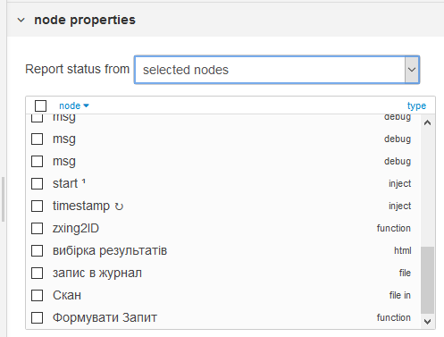

## 1.4.Основні вузли 

Палітра Node-RED включає стандартний набір вузлів, які є основними будівельними блоками для створення потоків. Цей розділ висвітлює основний набір, про який ви повинні знати. Ряд інших вузлів описано у відповідному розділі посібника

Всі вузли включають документацію, яку ви можете переглянути на вкладці Info бічної панелі коли вибираєте вузол.

### Inject (ініціювання повідомлення)

Вузол **Inject** може бути використаний для ручного запуску потоку, натиснувши кнопку вузла в редакторі. Він також може використовуватися для автоматичного запуску потоків через регулярні інтервали часу (рис.1.40).


рис.1.40. Налаштування вузла Inject

Повідомлення, надіслане вузлом Inject може мати набір атрибутів payload  (корисне навантаження) і topic (тема). Для payload можна встановити різні типи:

-   значення контексту потоку (flow context) або глобального контексту (global context)

-   рядок, число, логічне значення, Buffer або Object

-   відмітку часу (Timestamp) -- значення в мілісекундах з 1 січня 1970 року

-   \$env variable -- змінну середовища Node.js

### Debug (вивести на відлагодження)

Вузол Debug може ви використовуватися для відображення повідомлень на бічній панелі Debug у редакторі.

Бічна панель забезпечує структурований перегляд повідомлень, що надсилаються, що полегшує вивчення цього повідомлення. Поряд з кожним повідомленням бічна панель налагодження включає в себе інформацію про час надходження повідомлення та місце з якого вузлу воно надіслане. Натискання на ідентифікатор вихідного вузла покаже цей вузол у робочій області.

Кнопку на вузлі можна використовувати для ввімкнення або вимкнення його виходів. Рекомендується відключити або видалити будь-які вузли Debug, які не використовуються.

Цей вузол також може бути налаштований для відправлення всіх повідомлень до журналу середовища виконання, або для надсилання коротких (до 32 символів) повідомлень про статус налагоджуваного вузла.

### Function (функція)

{width="1.3125in" height="0.3541666666666667in"}Вузол Function дозволяє запускати код JavaScript для обробки повідомлень, які передаються через нього. Детальніше про використання вузла функцій розглянуто у відповідному розділі.

### Change (зміна повідомлення в потоці)

Вузол Change можна використовувати для зміни властивостей повідомлення та встановлення властивостей контексту без необхідності вдаватися до вузла Function. Кожен вузол може бути налаштований з декількома операціями, які застосовуються в такому порядку. Доступні операції:

-   **Set** - встановити властивість. Значення може бути з різними типами або може бути взяте з існуючого повідомлення або властивості контексту.

-   **Change** - пошук і заміна частин властивості повідомлення.

-   **Move** - перемістити або перейменувати властивість.

-   **Delete** -- видалити властивість.

При встановленні властивості це значення також може бути результатом виразу [JSONata](https://jsonata.org/) . JSONata - це декларативна мова запитів та перетворень для даних JSON. Детальніше про зміну повідомлення за допомогою цього вузла Ви можете [прочитати за посиланням](#_Зміна_властивостей_повідомлення).

### Switch (перемикач повідомлення)

{width="1.6770833333333333in" height="0.4479166666666667in"}Вузол Switch дозволяє передавати повідомлення до різних гілок потоку, оцінюючи набір правил для кожного повідомлення. Цей вузол налаштовано за допомогою властивості для перевірки - це може бути або властивість повідомлення (message property), або властивість контексту (context property).

Існує чотири типи правил:

-   **Value** - правила оцінюються для зконфігурованої властивості

-   **Sequence** - правила можуть бути використані для послідовності повідомлень, наприклад, ті, які створені вузлом Split

-   може бути надана JSONata **Expression**, який буде використаний для перевірки всього повідомлення і буде відповідати, якщо вираз повертає значення true .

-   **Otherwise** - правило може бути використане для відповідності, якщо жодне з попередніх правил не співпало.

Вузол переведе повідомлення на всі виходи, що відповідають правилам відповідності. Але він також може бути налаштований таким чином, щоб зупинити перевірку правил одразу, як знайдеться правило, що виконується.

### Template (шаблон)

Вузол Template може використовуватися для створення тексту за допомогою властивостей повідомлення для заповнення шаблону. Для формування результату він використовує шаблонну мову [Mustache](https://mustache.github.io/mustache.5.html) . Наприклад, шаблон:

```
This is the payload: {{payload}} !
```

замінить {{payload}} з значенням властивості повідомлення payload.

За замовчуванням, Mustache замінить певні символи своїми HTML-кодами. Щоб зупинити це, ви можете скористатися потрійними фіксаторами: {{{payload}}}. Mustache підтримують прості цикли у списках. Наприклад, якщо msg.payload містить масив імен, таких як: \[\"Nick\", \"Dave\", \"Claire\"\], то шаблон створить список HTML імен:

```html
<ul>
{{#payload}}
  <li>{{.}}</li>
{{/payload}}
</ul>

<ul>
  <li>Nick</li>
  <li>Dave</li>
  <li>Claire</li>
</ul>
```

Вузол встановить налагоджене повідомлення або контекстну властивість за результатом шаблону. Якщо шаблон генерує дійсний вміст JSON або YAML, його можна налаштувати для аналізу результату на відповідний об\'єкт JavaScript.

Вузол Template може використовуватися для створення тексту за допомогою властивостей повідомлення для заповнення шаблону.

### Status (стан вузлу)

Показує про стан (status message) виділених вузлів з потоку. За замовчуванням вузол повідомляє про стан всіх вузлів на одній вкладці робочого простору. Він може бути налаштований для повідомлення про стан окремих вузлів (рис.1.41).



рис.1.41. Вибір вузла, для якого означується стан.

Цей вузол не генерує payload, він формує об'єкт status, з наступними властивостями:

-   text (string) -- статусний текст

-   source.type (string) -- тип вузла, що передає статус

-   source.id (string) -- id вузла, що передає статус

-   source.name (string) -- ім'я, якщо є, вузла що передає статус

### Link In та Link Out (Посилання) 

{width="1.5104166666666667in" height="0.4479166666666667in"}

Створюють віртуальні з'єднання між потоками. Вузол може бути з\'єднаний з будь-яким посиланням у вузлі, який існує на будь-якій вкладці. Після підключення вони поводяться так, ніби вони з\'єднані між собою.

Провідники між вузлами зв\'язку відображаються тільки при виборі вузла зв\'язку. Якщо до інших вкладок є будь-які зв'язки, віртуальний вузол показує, який можна натиснути, щоб перейти до відповідної вкладки.

Link не можуть створюватися в/з підпотоків (subflows).

#  
